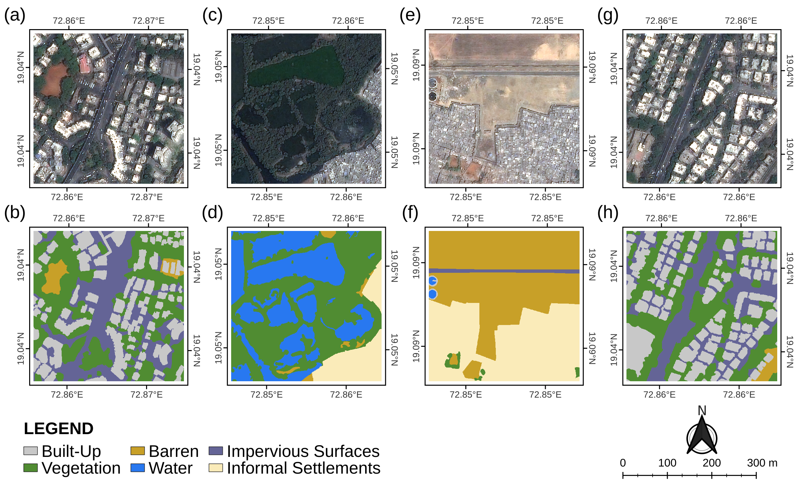
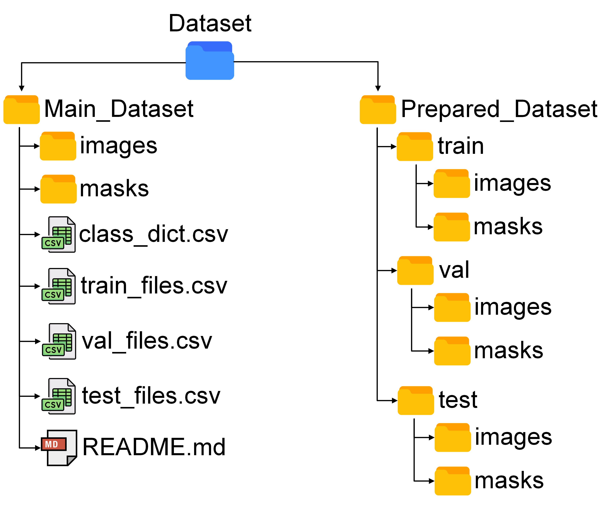
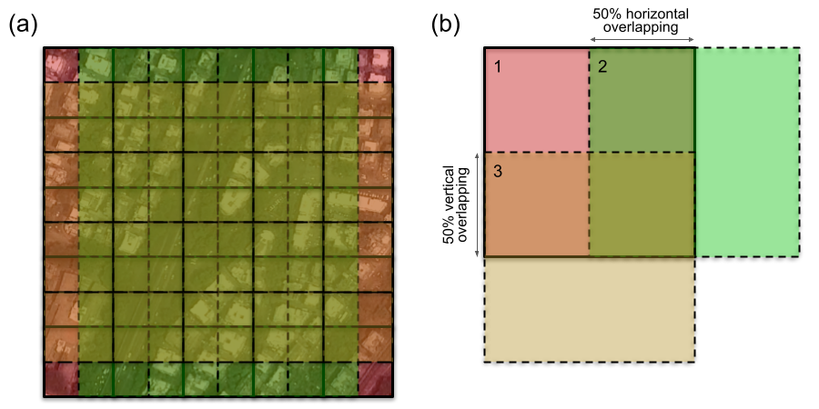

# Manually Annotated High Resolution Satellite Image Dataset of Mumbai for Semantic Segmentation

## Data Description

<p align="justify">
The dataset is divided into two groups, each including satellite images and their corresponding semantic segmentation masks. The images in each group are of two different sizes. The first group comprises 110 satellite images of size 600×600 pixels and manually labelled semantic segmentation masks. Figure 1 depicts some sample images and their labelled semantic segmentation masks from the first group. The second group contains three sets: training, validation, and testing. Each set consists of images of size 120×120 pixels which are derived and processed from the first group. Researchers can employ it to train and evaluate machine learning models. The first group is provided in the <code>Main_Dataset</code> directory, and the second group is provided in the <code>Prepared_Dataset</code> directory. All the image-mask pairs were named with the same file names, for example, <code>tile_5.37.tif</code> and <code>tile_5.37.png</code>. For the sample images, directory tree and description of the dataset, see Figure 1, Figure 2 and Table 1, respectively. The dataset is freely available here: <a href="https://data.mendeley.com/datasets/xj2v49zt26" target="_blank">https://data.mendeley.com/datasets/xj2v49zt26</a>.

 
</p>


<figure>
<p align="center">

</p>
<p align="center">
<b>Figure 1. </b>Original satellite images (a, c, e, g) and their corresponding segmentation masks (b, d, f, h).
</p>
</figure>


<figure>
<p align="center">

</p>
<p align="center">
<b>Figure 2. </b>The directory structure of the dataset.
</p>
</figure>

<div align="center">

<p align="center">
<b>Table 1. </b>Overview of the dataset directory structure and files.
</p>

| File/Directory Path                    | Description                                                                                               |
| -------------------------------------- | --------------------------------------------------------------------------------------------------------- |
| Dataset/Main_Dataset/images/           | Directory of original satellite images of 600×600 px size                                                 |
| Dataset/Main_Dataset/masks/            | Directory of labelled masks of 600×600 px size                                                            |
| Dataset/Main_Dataset/class_dict.csv    | CSV file containing RGB color codes of classes                                                            |
| Dataset/Main_Dataset/train_files.csv   | CSV file containing the file names of the image-mask pairs used in the Prepared_Dataset's training set.   |
| Dataset/Main_Dataset/val_files.csv     | CSV file containing the file names of the image-mask pairs used in the Prepared_Dataset's validation set. |
| Dataset/Main_Dataset/test_files.csv    | CSV file containing the file names of the image-mask pairs used in the Prepared_Dataset's testing set.    |
| Dataset/Prepared_Dataset/train/images/ | Directory of training set images                                                                          |
| Dataset/Prepared_Dataset/train/masks/  | Directory of training set masks                                                                           |
| Dataset/Prepared_Dataset/val/images/   | Directory of validation set images                                                                        |
| Dataset/Prepared_Dataset/val/masks/    | Directory of validation set masks                                                                         |
| Dataset/Prepared_Dataset/test/images/  | Directory of test set images                                                                              |
| Dataset/Prepared_Dataset/test/masks/   | Directory of test set masks                                                                               |

</div>

## Experimental Design, Material, and Methods

<p align="justify">
The dataset was created from high-resolution, true-color satellite imagery of Pleiades-1A acquired on March 15, 2017. Pleiades is an Airbus product that provides imagery with a 0.5m resolution at different spectral combinations. A total of 110 patches of size 600×600 pixels were selected by visually eyeballing random locations in the city that contain a wide variety of urban characteristics such as vegetation, slums, built-up, roads, etc. The patches were then manually labelled with polygons using Intel's Computer Vision Annotation Tool (CVAT). Six unique classes were used to categorize the images, namely (1) vegetation; (2) built-up; (3) informal settlements; (4) impervious surfaces (roads/highways, streets, parking lots, road-like areas around buildings, etc.); (5) barren; and (6) water. In addition to these six major classes, the dataset also contains another class termed ‘Unlabelled’, which makes up only 0.08% of the dataset. It primarily consists of airplanes and a few other obscure spots and structures. The ground truth's color legend is described in Table 2 below. Each 600×600 pixels patch was further divided into 120×120 pixels sized tiles with 50% horizontal and vertical overlapping (see Figure 3), making a total of 8910 tiles. This helped in the generation of more training data that would result in better classification. Out of the total 8910 labelled patches, 80% patches (total: 7128) are present in the training set, 10% as the validation set (total: 891), and the remaining 10% for testing (total: 891). Table 3 illustrates the distribution of the classes in the datasets.
</p>


<div align="center">

<p align="center">
<b>Table 2. </b>The semantic classes, their RGB codes, and respective colors in the segmentation masks.
</p>

| Class                	| RGB Values    	| Color 	|
|----------------------	|---------------	|-------	|
| Built-Up             	| 200, 200, 200 	|<p align="center"></p>|
| Vegetation           	| 80, 140, 50   	|<p align="center"></p>|
| Barren               	| 200, 160, 40  	|<p align="center"></p>|
| Water                	| 40, 120, 240  	|<p align="center"></p>|
| Impervious Surfaces  	| 100, 100, 150 	|<p align="center"></p>|
| Informal Settlements 	| 250, 235, 185 	|<p align="center"></p>|
| _Unlabelled_         	| _0, 0, 0_     	|<p align="center"></p>|

</div>

<figure>
<p align="center">

</p>
<p align="center">
<b>Figure 3. </b>Tile preparation methodology of <code>Prepared_Dataset</code>: 50% horizontal and vertical overlapping.
</p>
</figure>


<!-- <style type="text/css">
.tg  {border-collapse:collapse;border-spacing:0;}
.tg td{border-color:black;border-style:solid;border-width:1px;
  overflow:hidden;padding:10px 5px;word-break:normal;}
.tg th{border-color:black;border-style:solid;border-width:1px;
  font-weight:normal;overflow:hidden;padding:10px 5px;word-break:normal;}
.tg .tg-0gmh{border-color:#000000;font-style:italic;text-align:center;vertical-align:middle}
.tg .tg-18eh{border-color:#000000;font-weight:bold;text-align:center;vertical-align:middle}
.tg .tg-en52{border-color:#000000;font-style:italic;font-weight:bold;text-align:center;vertical-align:middle}
.tg .tg-xwyw{border-color:#000000;text-align:center;vertical-align:middle}
</style> -->

<div align="center">

<p align="center">
<b>Table 3. </b>Distribution of labels in the main dataset and prepared dataset (in percentages).
</p>

<table class="tg">
<thead>
  <tr>
    <th class="tg-18eh" colspan="2" rowspan="2">Dataset</th>
    <th class="tg-18eh" colspan="7"><span style="font-weight:bold">Semantic Classes</span></th>
  </tr>
  <tr>
    <th class="tg-18eh"><span style="font-weight:bold">Built-Up</span></th>
    <th class="tg-18eh"><span style="font-weight:bold">Vegetation</span></th>
    <th class="tg-18eh"><span style="font-weight:bold">Barren</span></th>
    <th class="tg-18eh"><span style="font-weight:bold">Water</span></th>
    <th class="tg-18eh"><span style="font-weight:bold">Impervious</span><br>Surfaces</th>
    <th class="tg-18eh"><span style="font-weight:bold">Informal</span><br>Settlements</th>
    <th class="tg-en52"><span style="font-weight:bold;font-style:italic">Unlabelled</span></th>
  </tr>
</thead>
<tbody>
  <tr>
    <td class="tg-xwyw" colspan="2"><span style="font-weight:normal">Main Dataset</span></td>
    <td class="tg-xwyw"><span style="font-weight:normal">9.49</span></td>
    <td class="tg-xwyw"><span style="font-weight:normal">18.82</span></td>
    <td class="tg-xwyw"><span style="font-weight:normal">15.89</span></td>
    <td class="tg-xwyw"><span style="font-weight:normal">31.86</span></td>
    <td class="tg-xwyw"><span style="font-weight:normal">12.15</span></td>
    <td class="tg-xwyw"><span style="font-weight:normal">11.7</span></td>
    <td class="tg-0gmh"><span style="font-weight:normal;font-style:italic">0.08</span></td>
  </tr>
  <tr>
    <td class="tg-xwyw" rowspan="3">Prepared Dataset</td>
    <td class="tg-xwyw"><span style="font-weight:normal">Training</span></td>
    <td class="tg-xwyw"><span style="font-weight:normal">9.72</span></td>
    <td class="tg-xwyw"><span style="font-weight:normal">19.2</span></td>
    <td class="tg-xwyw"><span style="font-weight:normal">16.04</span></td>
    <td class="tg-xwyw"><span style="font-weight:normal">32.36</span></td>
    <td class="tg-xwyw"><span style="font-weight:normal">11.51</span></td>
    <td class="tg-xwyw"><span style="font-weight:normal">11.06</span></td>
    <td class="tg-0gmh"><span style="font-weight:normal;font-style:italic">0.1</span></td>
  </tr>
  <tr>
    <td class="tg-xwyw"><span style="font-weight:normal">Validation</span></td>
    <td class="tg-xwyw"><span style="font-weight:normal">5.8</span></td>
    <td class="tg-xwyw"><span style="font-weight:normal">13.98</span></td>
    <td class="tg-xwyw"><span style="font-weight:normal">12.74</span></td>
    <td class="tg-xwyw"><span style="font-weight:normal">31.26</span></td>
    <td class="tg-xwyw"><span style="font-weight:normal">15.49</span></td>
    <td class="tg-xwyw"><span style="font-weight:normal">20.73</span></td>
    <td class="tg-0gmh"><span style="font-weight:normal;font-style:italic">0</span></td>
  </tr>
  <tr>
    <td class="tg-xwyw"><span style="font-weight:normal">Testing</span></td>
    <td class="tg-xwyw"><span style="font-weight:normal">7.86</span></td>
    <td class="tg-xwyw"><span style="font-weight:normal">19.93</span></td>
    <td class="tg-xwyw"><span style="font-weight:normal">17.36</span></td>
    <td class="tg-xwyw"><span style="font-weight:normal">28.82</span></td>
    <td class="tg-xwyw"><span style="font-weight:normal">16.84</span></td>
    <td class="tg-xwyw"><span style="font-weight:normal">9.19</span></td>
    <td class="tg-0gmh"><span style="font-weight:normal;font-style:italic">0</span></td>
  </tr>
</tbody>
</table>

</div>


## Citing this work

<p align="justify">
If you use this dataset in a scientific publication, please consider citing:
</p>

```
@misc{https://doi.org/10.17632/xj2v49zt26.1,
  doi = {10.17632/XJ2V49ZT26.1},
  url = {https://data.mendeley.com/datasets/xj2v49zt26/1},
  author = {{Ayush Dabra}},
  title = {Manually Annotated High Resolution Satellite Image Dataset of Mumbai for Semantic Segmentation},
  publisher = {Mendeley},
  year = {2023},
  copyright = {Creative Commons Attribution 4.0 International}
}

@article{Dabra2023,
  doi = {10.1007/s00521-023-08320-7},
  url = {https://doi.org/10.1007/s00521-023-08320-7},
  year = {2023},
  month = feb,
  publisher = {Springer Science and Business Media {LLC}},
  author = {Ayush Dabra and Vaibhav Kumar},
  title = {Evaluating green cover and open spaces in informal settlements of Mumbai using deep learning},
  journal = {Neural Computing and Applications}
}
```
